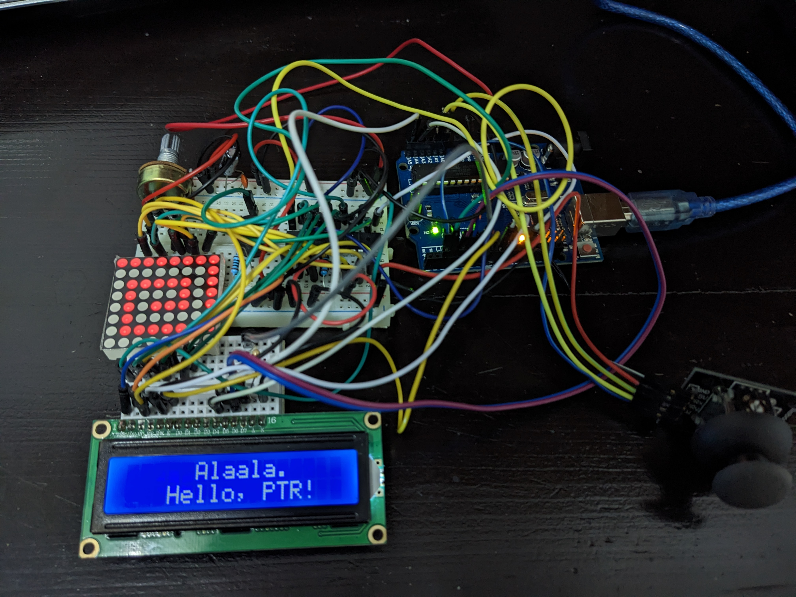
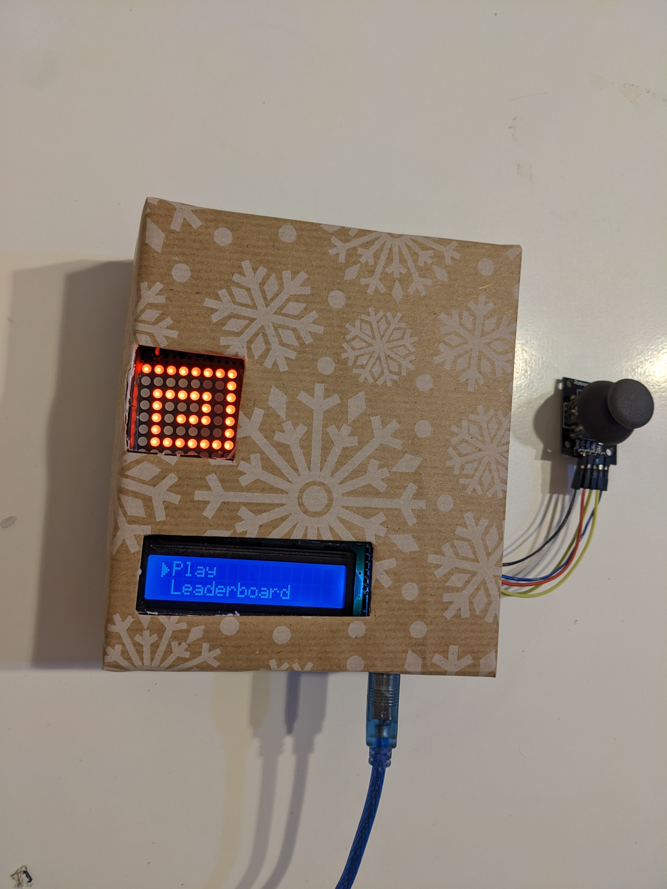

<body>
<h1 align="center">Alaala</h1>

&emsp;   This is a memory game developed on an Arduino Uno board for the Introduction to Robotics course.  

&emsp;   The screen where the player sees the game is an 8 by 8 LED matrix so there is no much space for a complex game, so I chose a pretty simple game where you have to memorize the pattern shown on screen and then try to recreate it using a joystick to move the dot on the matrix. The main physical components of the game are the Arduino board, the 8 by 8 LED matrix with the MAX7219 Driver, the 16 by 2 LCD display, the joystick and the buzzer. Those were all conected using 2 breadboards, resistors, a potentiometer, capacitors and wires.

 

  
 

&emsp;   The game is divided in levels and you have to memorize a little more complex pattern at each level( at level N you have a pattern which consists in N individual cells). There are 2 difficulty setting, the easy one has cells of 2 by 2 LEDs, so the board has 16 cells and the hard one has 1 by 1 cells in a total of 64 cells. The score system is the same in both difficulties so you have 3 lives in the hard one to compensate it. Every time you hit play you can choose at what level to start, but not one higher then you reached before.  

&emsp;   When you open the game the first thing to see in a greeting message that says "Hello" and your name, then you enter the menu where you can select using the joystick to start the game, to see the leaderboard, to enter the settings, to enter the "about" section where you see details about the developer or to enter in the "how to play" section. The enter action is made by click on the joystick and the back action is made with a left move.  

&emsp;   In the settings section you can edit your name, change the difficulty, change the brightness of the LCD and the LED matrix, put the game on mute and make a factory reset(by moving the joystick to the right 3 times).  

&emsp;   Codewise, all of that is made by running an infinite loop with a global state. At every iteration the program checks what is the current state(game, menu, settings etc.) and runs a specific function for that state. You can change the state with different actions(ex: click on play gets you from menu to game) and when you perform those actions the global variable state changes and the program will be directed to another function at the next iteration. The game feels fluid because there are more then 100 iteration every second.  

 

  
 

 
&emsp; The requirements for this project can be found <a href="assets/requirements .pdf" class="image fit" >here</a> and there is a <a href=https://youtu.be/2a9stHlteWE>link</a> to a video where I use the game.

</body>
